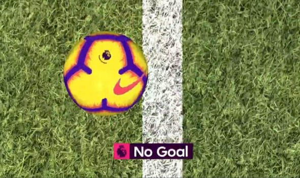

# Goal-Line-Technology
Our goal is to develop an android app that captures a video and detects whether the ball has crossed the line completely or not. In other words it decides if it’s a GOAL or NO GOAL.

# Introduction: 
Goal Line Technology (sometimes referred to as a Goal Decision System is the use of electronic aid to determine if a goal has been scored or not. In detail, it is a method used to determine when the ball has completely crossed the goal line in between the goal-posts and underneath the crossbar with the assistance of electronic devices and the device will decide if it’s a goal or not. 
As shown in the figure below: 

  

# Input: 
Input will be a video recorded by the android application of a white line and a ball passing over that line. The mobile camera will be placed perfectly still to capture the video separated from the white line by a fair distance vertically. 

# Processing operation: 
Processing is done on the video by tracking the ball during crossing the white line. Output: 

# Output will be: 
1. Goal if the whole ball completely passes over the line. 
2. No Goal if the ball rebounded without completely passing over the line. 

# Project Implementation:: 
Consists of two parts: 
1. Developing an android app. 
2. Video Processing using opencv.

# Work Distribution: 
Mohamed Ashraf Youssef : Android Development 
Mahmoud Yasser Mohamed : Android Development 
Mahmoud Mohamed Kholeif : Video Processing 
Mohamed Ahmed Abdelhamid : Video Processing 
Mohamed Mustafa Yaman : Video Processing 
