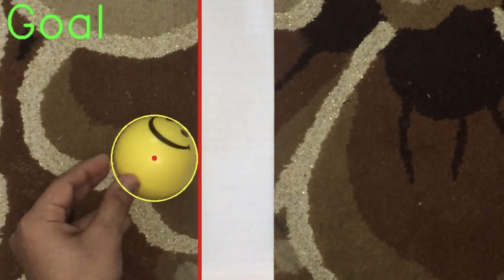

# Goal-Line-Technology :
Our goal is to develop an executable file , through it we can upload a video and detects whether the ball has crossed the line completely or not. In other words it decides if it’s a GOAL or NO GOAL.

# For Testing :
open ( final project with gui ) folder, and execute image.exe file , then upload any video and test it .

# Work Distribution :

Names                    | IDs                                                                                                                                                                                                                                                                                                                                            | Contribution
------------------------ | --------------------------------------------------------------------------------------------------------------------------------------------------------------------------------------------------------------------------------------------------------------------------------------------------------------------------------------------- | ---------
**Mohamed Ashraf Youssef**            | 1501158                                                                                                                                                              | Gui
**Mahmoud Yasser Mohamed**            | 16X0120                                                                                                                                                              | Gui
**Mahmoud Mohamed Kholeif**           | 1501370                                                                                                                                                              | Video Processing
**Mohamed Mostafa Yaman**             | 15W0032                                                                                                                                                              | Video Processing
**Mohamed Ahmed Abdelhamid**          | 1501132                                                                                                                                                              | Video Processing

# Introduction : 
Goal Line Technology (sometimes referred to as a Goal Decision System is the use of electronic aid to determine if a goal has been scored or not. In detail, it is a method used to determine when the ball has completely crossed the goal line in between the goal-posts and underneath the crossbar with the assistance of electronic devices and the device will decide if it’s a goal or not. 
As shown in the figure below: 

  

  

# Input : 
Input will be a video of a white line and a ball passing over that line. The camera will be placed perfectly still to capture the video separated from the white line by a fair distance vertically. 

# Processing operation : 
Processing is done on the video by tracking the ball during crossing the white line. 

# Output : 
Output will be : 
1. Goal if the whole ball completely passes over the line. 
2. No Goal if the ball rebounded without completely passing over the line. 

# Project Implementation :
Consists of two parts: 
1. Gui to upload video to be tested. 
2. Video Processing using opencv.

